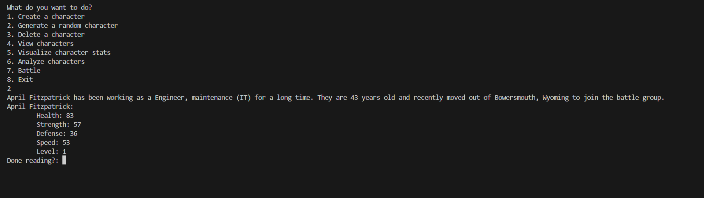
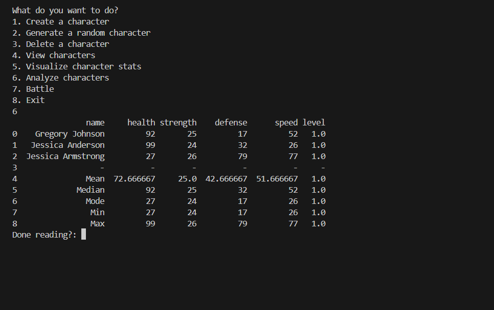

# Name of the project

## Project Description
---
This project is a battle simulator where you can create characters and have them fight each other to level up.  

## Installation
---
1. Install the necessary libraries
2. Run the program

## Execution and Usage
---
You can create characters, then manipulate, visualize, and do other things with them.

+ Manipulation - Character creation, generation, and deletion
+ Visualization - Create a bar graph, standard view, analyze/compare characters, 
+ Battle - You can make characters fight each other, which will level them up and add a multiplier to their stats.

 
  

## Used Technologies
---
+ Matplotlib - Creates the visualizations (bar graph)
`pip install matplotlib`
+ Faker - generates fake characters automatically
`pip install faker`
+ Pandas - creates data frames
`pip install pandas`  

## Current Features
---
+ Generate characters automatically
+ Compare characters with ease
+ Battle characters to level up  

## Contributing
---
N/A  

## Contributors
---
+ Jonas - coded the majority of the program
+ Cecily - helped with the data frames  

## Author Info
---
My name is Jonas, and I am a 9th grade student with access to a computer science lab, where I create neat projects like this sometimes.
Phone: +1 (385) 338-9229    Email: jonasfairchild@gmail.com  

## Changelog
---
N/A  

## License
---
N/A